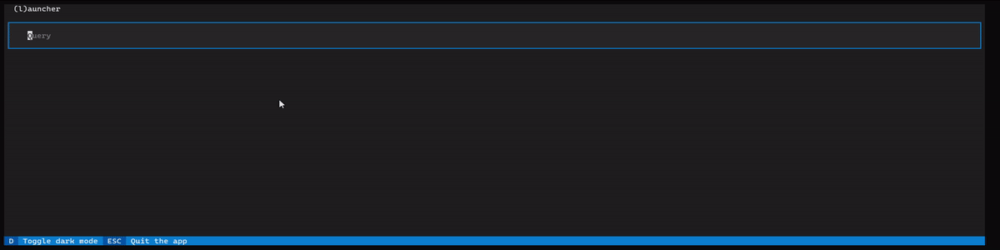

# TermLauncher
This is an early version of a command-line based key launcher using Textual.



## Why another key launcher?
I really love the ability to hit a hot-key and quickly access features of applications through the many API's available. The problem for me was, it was overly difficult to write plugins. This application uses command-line applications as input and output. So plugins for this application are short entries in a settings.json file and a seperate command-line application that can output an array in JSON. Or even just a simple entry in the settings.json alone!

## Install and start
To install, use pip;

```
pip install termlauncher
```